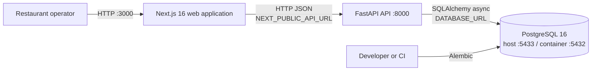

# System context

Last verified: 2026-09-16.

RestaurantOS currently runs as a small modular-monolith-shaped application: one
Next.js frontend, one FastAPI process, and one PostgreSQL database. Only the
database is containerized for local development.



## Runtime responsibilities

| Component | Current responsibility |
|---|---|
| Next.js | Routes, forms, restaurant navigation, order list/actions, dashboard rendering, and API calls |
| FastAPI | HTTP validation, CRUD orchestration, price calculation, persistence, and analytics queries |
| PostgreSQL | System of record for restaurants, menus, menu items, orders, and order items |
| Alembic | Ordered schema creation and future schema evolution |
| Docker Compose | Local PostgreSQL lifecycle only |

## Boundaries and dependencies

The current backend dependency direction is effectively:

```text
FastAPI router -> SQLAlchemy model/session -> PostgreSQL
```

Pydantic schemas define request and response contracts, but business logic and
transaction orchestration remain in routers. Milestone 0 documents this rather
than restructuring it. ADR 0001 records the intended gradual direction:

```text
router -> application service/use case -> domain/repository -> infrastructure
```

## Trust and configuration boundaries

- Browser-visible API configuration usually uses `NEXT_PUBLIC_API_URL`; the
  root-page connectivity probe still hardcodes the localhost API URL.
- Backend and Alembic use `DATABASE_URL`.
- CORS currently permits only `http://localhost:3000`.
- There is no authentication, authorization, tenant boundary, Redis, worker,
  object storage, or external payment provider in the current system.
- `/health` is a process liveness response and does not query dependencies.
  No readiness endpoint is claimed or added in Milestone 0.
- SQLAlchemy SQL echo is currently always enabled and is a documented logging
  risk for a later configuration-focused change.

## Deployment context

There are no backend or frontend Dockerfiles and no deployed environment is
defined in this repository. GitHub Actions provides validation only. Production
containerization, release migrations, deployment, and observability remain
later roadmap milestones.
