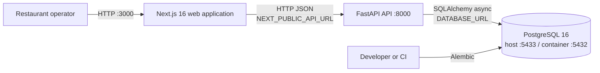

# System context

Last verified: 2026-09-16.

RestaurantOS currently runs as a small modular-monolith-shaped application: one
Next.js frontend, one FastAPI process, and one PostgreSQL database. Only the
database is containerized for local development.


```mermaid
flowchart LR
    U[Restaurant operator] -->|HTTP :3000| W[Next.js 16 web application]
    W -->|HTTP JSON<br/>NEXT_PUBLIC_API_URL| A[FastAPI API :8000]
    A -->|SQLAlchemy async<br/>DATABASE_URL| P[(PostgreSQL 16<br/>host :5433 / container :5432)]
    D[Developer or CI] -->|Alembic| P
```

## Runtime responsibilities

| Component | Current responsibility |
|---|---|
| Next.js | Routes, forms, restaurant navigation, order list/actions, dashboard rendering, and API calls |
| FastAPI routers | HTTP validation, dependency injection, status codes, and response mapping |
| Application services | Use-case orchestration, business rules, and explicit write transaction boundaries |
| Repositories | Focused SQLAlchemy persistence and analytics queries without HTTP knowledge |
| PostgreSQL | System of record for restaurants, menus, menu items, orders, and order items |
| Alembic | Ordered schema creation and future schema evolution |
| Docker Compose | Local PostgreSQL lifecycle only |

## Boundaries and dependencies

The backend now follows the modular-monolith dependency direction established
by ADR 0001:

```text
FastAPI router -> application service -> domain/repository -> PostgreSQL
```

Pydantic schemas remain at the HTTP boundary and SQLAlchemy models remain in
the persistence boundary. Order state/payment rules are framework-independent.
The request dependency owns session lifetime, application command services own
transactions, and repositories never commit or roll back.

## Trust and configuration boundaries

- Browser-visible API configuration usually uses `NEXT_PUBLIC_API_URL`; the
  root-page connectivity probe still hardcodes the localhost API URL.
- Backend and Alembic share typed settings sourced from `DATABASE_URL`.
- Tests require a separate `TEST_DATABASE_URL` whose database name ends in
  `_test`; the harness refuses to truncate the development database.
- `ENVIRONMENT`, `LOG_LEVEL`, and `DATABASE_ECHO` are validated settings.
- CORS currently permits only `http://localhost:3000`.
- There is no authentication, authorization, tenant boundary, Redis, worker,
  object storage, or external payment provider in the current system.
- `/health` is a process liveness response and does not query dependencies.
  No readiness endpoint is claimed or added in Milestone 0.
- Structured JSON logging includes a validated or generated request ID, which
  is also returned in the `X-Request-ID` response header. SQL echo is disabled
  by default and is explicitly configurable.

## Deployment context

There are no backend or frontend Dockerfiles and no deployed environment is
defined in this repository. GitHub Actions provides validation only. Production
containerization, release migrations, deployment, and observability remain
later roadmap milestones.
