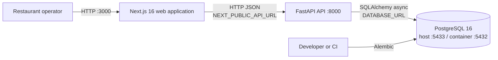

# System context

Last updated: 2026-09-30.

RestaurantOS currently runs as a small modular-monolith-shaped application: one
Next.js frontend, one FastAPI process, and one PostgreSQL database. Only the
database is containerized for local development.


```mermaid
flowchart LR
    U[Restaurant operator] -->|HTTP :3000| W[Next.js 16 web application]
    W -->|HTTP JSON<br/>NEXT_PUBLIC_API_URL| A[FastAPI API :8000]
    A -->|SQLAlchemy async<br/>DATABASE_URL| P[(PostgreSQL 16<br/>host :5433 / container :5432)]
    D[Developer or CI] -->|Alembic| P
```

## Runtime responsibilities

| Component | Current responsibility |
|---|---|
| Next.js | Login/renewal/logout, browser and server credential transports, restaurant navigation, operational forms and dashboard |
| FastAPI routers | HTTP validation, dependency injection, status codes, and response mapping |
| Application services | Use-case orchestration, business rules, and explicit write transaction boundaries |
| Repositories | Focused SQLAlchemy persistence and analytics queries without HTTP knowledge |
| PostgreSQL | Operational records, users, session families, refresh-token digests and auth rate counters |
| Alembic | Ordered schema creation and future schema evolution |
| Docker Compose | Local PostgreSQL lifecycle only |

## Boundaries and dependencies

The backend now follows the modular-monolith dependency direction established
by ADR 0001:

```text
FastAPI router -> application service -> domain/repository -> PostgreSQL
```

Pydantic schemas remain at the HTTP boundary and SQLAlchemy models remain in
the persistence boundary. Order state/payment rules are framework-independent.
The request dependency owns session lifetime, application command services own
transactions, and repositories never commit or roll back.

Authentication is the first feature-first module, `app/modules/auth`, containing
its router, schemas, service, domain and repo. Existing catalog/order/analytics
layers remain in place. Principal lookup uses its own short-lived read session
so it does not open a transaction on a business command's session.

## Trust and configuration boundaries

- Browser-visible API configuration usually uses `NEXT_PUBLIC_API_URL`; the
  root-page connectivity probe still hardcodes the localhost API URL.
- Backend and Alembic share typed settings sourced from `DATABASE_URL`.
- Tests require a separate `TEST_DATABASE_URL` whose database name ends in
  `_test`; the harness refuses to truncate the development database.
- `ENVIRONMENT`, `LOG_LEVEL`, and `DATABASE_ECHO` are validated settings.
- Authentication uses Argon2id, short access JWT cookies, rotating opaque refresh
  cookies, server-side revocation/replay detection and PostgreSQL rate limits.
- CORS permits exact configured origins; unsafe operations also check Origin and
  a custom CSRF header. Production cookies require HTTPS on one shared host.
- All business routes require active identity. There is no RBAC or tenant
  boundary yet; provisioned accounts share the existing workspace.
- There is no Redis, worker,
  object storage, or external payment provider in the current system.
- `/health` is a process liveness response and does not query dependencies.
  No readiness endpoint is claimed or added in Milestone 0.
- Structured JSON logging includes a validated or generated request ID, which
  is also returned in the `X-Request-ID` response header. SQL echo is disabled
  by default and is explicitly configurable.

## Deployment context

There are no backend or frontend Dockerfiles and no deployed environment is
defined in this repository. GitHub Actions provides validation only. Production
containerization, release migrations, deployment, and observability remain
later roadmap milestones.
